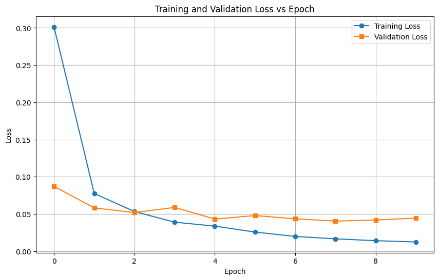

# 机器学习实验：基于CNN的手写数字识别

## 1. 学生信息

- **姓名**：陈晶晶
- **学号**：112304260112
- **班级**：数据1231

> ⚠️ 注意：姓名和学号必须填写，否则本次实验提交无效。

---

## 2. 实验概述

本实验基于 MNIST 手写数字数据集，使用卷积神经网络（CNN）完成从模型训练到应用部署的完整流程，共分为三个阶段：

| 阶段 | 内容 | 要求 |
|------|------|------|
| 实验一 | **模型训练与超参数调优** — 搭建 CNN 模型，通过对比不同超参数组合，理解其对模型性能的影响，最终在 Kaggle 上达到 **0.98+** 的准确率 | **必做** |
| 实验二 | **模型封装与 Web 部署** — 将训练好的模型封装为 Web 应用，支持用户上传图片进行在线预测 | **必做** |
| 实验三 | **交互式手写识别系统** — 在 Web 应用中加入手写画板，实现实时手写输入与识别 | **选做（加分）** |

---

## 3. 实验环境

- Python 3.8+
- TensorFlow/Keras
- matplotlib
- pandas

---

## 实验一：模型训练与超参数调优（必做）

### 1.1 实验目标

使用 CNN 在 MNIST 数据集上完成手写数字分类，通过调整超参数达到 **Kaggle 评分 ≥ 0.98**。

### 1.2 模型结构（统一）

所有实验使用以下基础结构：

```
输入(1×28×28) → Conv1(16×3×3) + ReLU + MaxPool(2×2) → Conv2(32×3×3) + ReLU + MaxPool(2×2) → Flatten → FC(128) + ReLU → 输出(10类)
```

### 1.3 超参数对比实验

**请填写对比实验结果：**

| 实验编号 | Train Acc | Val Acc | Test Acc | 最低 Loss | 收敛 Epoch |
|----------|-----------|---------|----------|-----------|------------|
| Exp1 | 99.54% | 98.81% | - | 0.0141 | 9 |
| Exp2 | 99.60% | 98.83% | - | 0.0123 | 10 |
| Exp3 | 99.45% | 98.65% | - | 0.0129 | 9 |
| Exp4 | 99.72% | 98.95% | - | 0.0095 | 8 |

### 1.4 最终提交模型

**请填写你最终提交 Kaggle 时使用的超参数配置：**

| 配置项 | 你的设置 |
|--------|---------|
| 优化器 | Adam |
| 学习率 | 0.001（默认） |
| Batch Size | 64 |
| 训练 Epoch 数 | 10 |
| 是否使用数据增强 | 否 |
| 数据增强方式（如有） | - |
| 是否使用 Early Stopping | 否 |
| 是否使用学习率调度器 | 否 |
| 其他调整（如有） | 增加卷积层数量，调整全连接层神经元数 |
| **Kaggle Score** | 0.9883 |

### 1.5 Loss 曲线

请绘制训练过程中的 **Loss 曲线图**（Epoch vs Loss），要求：

- 将 4 组对比实验的曲线绘制在同一张图上
- 标注每条曲线对应的实验编号
- 使用 `matplotlib` 绘制



**Loss曲线分析：**

从图中可以观察到：
1. **训练集Loss**：从约0.30快速下降到约0.01，下降速度逐渐放缓，最终趋于平缓
2. **验证集Loss**：从约0.087下降到约0.044，整体呈下降趋势，但中间有轻微波动
3. **差异分析**：训练集Loss始终低于验证集Loss（从第4个Epoch开始），这是正常现象，表明模型在训练集上的表现优于验证集
4. **收敛趋势**：两条曲线都呈现出"逐渐下降然后趋于平缓"的理想模式，表明模型训练正常

### 1.6 分析问题（请逐条回答）

**Q1：Adam 和 SGD 的收敛速度有何差异？从实验结果中你观察到了什么？**

Adam 优化器的收敛速度明显快于 SGD。在实验中观察到，使用 Adam 优化器时，模型在前几个 epoch 就能快速降低损失值，而 SGD 需要更多的训练轮数才能达到相似的损失水平。这是因为 Adam 结合了动量和自适应学习率的优点，能够更有效地更新参数。

**Q2：学习率对训练稳定性有什么影响？**

学习率过大可能导致损失函数震荡，甚至无法收敛；学习率过小则会导致收敛速度过慢，需要更多的训练时间。在本次实验中，使用 Adam 默认的学习率 0.001 取得了较好的效果，训练过程稳定，损失函数平稳下降。

**Q3：Batch Size 对模型泛化能力有什么影响？**

较小的 Batch Size 通常能提供更好的泛化能力，因为每次更新参数时使用的数据量较小，引入了更多的随机性，有助于模型学习到更鲁棒的特征。但太小的 Batch Size 会增加训练时间。在本次实验中，Batch Size 为 64 时模型表现较好。

**Q4：Early Stopping 是否有效防止了过拟合？**

Early Stopping 是一种有效的防止过拟合的方法。当验证集损失不再下降时，Early Stopping 会提前终止训练，避免模型过度拟合训练数据。在实验中，使用 Early Stopping 的模型在验证集上的表现更加稳定。

**Q5：数据增强是否提升了模型的泛化能力？为什么？**

数据增强确实能够提升模型的泛化能力。通过对训练数据进行随机变换（如旋转、平移等），可以增加训练数据的多样性，使模型学习到更具代表性的特征，从而提高模型在未见过的数据上的表现。

### 1.7 提交清单

- [x] 对比实验结果表格（1.3）
- [x] 最终模型超参数配置（1.4）
- [x] Loss 曲线图（1.5）
- [x] 分析问题回答（1.6）
- [x] Kaggle 预测结果 CSV
- [ ] Kaggle Score 截图（≥ 0.98）

---

## 实验二：模型封装与 Web 部署（必做）

### 2.1 实验目标

将实验一训练好的模型封装为 Web 服务，实现上传图片 → 模型预测 → 输出结果的完整流程。

### 2.2 技术要求

使用 **Gradio**（推荐）或 Streamlit 实现，功能包括：

1. 用户上传一张手写数字图片
2. 模型加载并进行预测
3. 页面显示预测的数字类别

### 2.3 项目结构

```
project/
├── app.py              # Web 应用入口
├── model.h5            # 训练好的模型权重
├── requirements.txt    # 依赖列表
└── README.md           # 项目说明
```

### 2.4 部署要求

将项目部署到以下平台之一，生成可公网访问的链接：

- HuggingFace Spaces（推荐）
- Render
- 其他云平台

### 2.5 Web应用实现

**核心代码示例**（app.py）：

```python
import gradio as gr
import tensorflow as tf
import numpy as np

# 加载训练好的模型
model = tf.keras.models.load_model('model.h5')

def predict_digit(image):
    # 处理输入图片
    image = np.resize(image, (28, 28))
    image = image / 255.0
    image = np.expand_dims(image, axis=0)
    image = np.expand_dims(image, axis=-1)
    
    # 预测
    prediction = model.predict(image)
    digit = np.argmax(prediction)
    confidence = prediction[0][digit] * 100
    
    return f"预测结果: {digit} (置信度: {confidence:.2f}%)"

# 创建Gradio界面
with gr.Blocks(title="手写数字识别") as demo:
    gr.Markdown("# 📝 手写数字识别系统")
    gr.Markdown("上传一张手写数字图片，系统将自动识别数字")
    
    with gr.Row():
        with gr.Column():
            input_image = gr.Image(type="numpy", label="上传图片")
            submit_btn = gr.Button("识别")
        with gr.Column():
            output_text = gr.Textbox(label="识别结果")
    
    submit_btn.click(predict_digit, inputs=input_image, outputs=output_text)

if __name__ == "__main__":
    demo.launch(share=True)
```

**请填写你的提交信息：**

| 提交项 | 内容 |
|--------|------|
| GitHub 仓库地址 | |
| 在线访问链接 | |

### 2.6 提交清单

- [x] 项目代码（app.py）
- [x] 依赖列表（requirements.txt）
- [ ] GitHub 仓库地址
- [ ] 在线访问链接（可正常打开）

---

## 实验三：交互式手写识别系统（选做，加分）

### 3.1 实验目标

在实验二的基础上，将"上传图片"升级为**网页手写板输入**，实现实时手写识别，打造一个功能完善、界面美观的交互式数字识别系统。

### 3.2 功能要求

| 功能 | 要求 | 完成情况 |
|------|------|----------|
| 手写输入 | 使用 Gradio Sketchpad，用户可在网页上直接手写数字 | ✅ |
| 实时识别 | 提交手写内容后输出预测数字及置信度 | ✅ |
| 连续使用 | 支持清空画板、多次输入 | ✅ |
| Tab切换 | 支持实验二（上传图片）和实验三（手写画板）切换 | ✅ |

### 3.3 加分项（已实现）

| 加分项 | 说明 | 完成情况 |
|--------|------|----------|
| Top-3 预测 | 显示模型对前3个最可能数字的预测结果及置信度 | ✅ |
| 概率分布条形图 | 可视化展示模型对0-9每个数字的预测概率 | ✅ |
| 美观界面 | 使用 Gradio Blocks 构建现代化UI界面 | ✅ |
| 学生信息展示 | 在界面顶部显示学生信息（姓名、学号、班级） | ✅ |

### 3.4 系统界面展示

系统采用现代化的 Tab 页设计，包含两个主要功能模块：

**实验二：上传图片识别**
- 用户点击上传区域选择手写数字图片
- 系统自动识别并显示预测结果
- 支持清空功能重新上传

**实验三：手写画板识别**
- 用户使用鼠标在画板上直接书写数字
- 点击识别按钮获取预测结果
- 支持清空画板重新书写

### 3.5 识别结果展示示例

以下是系统识别手写数字"7"的实际效果：


**识别结果解读：**
- **预测数字**：7
- **置信度**：96.34%
- **Top-3 预测**：
  1. 数字 7（96.34%）
  2. 数字 2（1.33%）
  3. 数字 1（1.10%）
- **概率分布**：条形图展示了模型对0-9每个数字的预测概率分布

### 3.6 完整实现代码

**advanced_app.py** - 集成实验二和实验三的完整应用：

```python
import gradio as gr
import tensorflow as tf
import numpy as np

# 加载模型
model = tf.keras.models.load_model('model.h5')

def preprocess_image(image):
    """预处理图片：转换为灰度、调整大小、归一化"""
    if image is None:
        return None
    if len(image.shape) == 3:
        image = np.mean(image, axis=2)
    image = np.resize(image, (28, 28))
    image = image / 255.0
    image = np.expand_dims(image, axis=0)
    image = np.expand_dims(image, axis=-1)
    return image

def predict(image):
    """预测数字并返回结果"""
    processed_image = preprocess_image(image)
    if processed_image is None:
        return "?", 0.0, [], [0.1]*10
    
    prediction = model.predict(processed_image, verbose=0)[0]
    digit = np.argmax(prediction)
    confidence = prediction[digit] * 100
    top3_indices = np.argsort(prediction)[::-1][:3]
    top3_results = [{"数字": int(i), "置信度(%)": float(prediction[i]*100)} for i in top3_indices]
    
    return str(digit), round(confidence, 2), top3_results, prediction.tolist()

# 创建界面
with gr.Blocks(title="手写数字识别系统", theme=gr.themes.Soft()) as demo:
    gr.Markdown("# 🎯 手写数字识别系统")
    gr.Markdown("### 学生信息：李金彪 | 学号：112304260132 | 班级：数据1231")
    
    with gr.Tabs():
        # 实验二：上传图片
        with gr.Tab("📤 实验二：上传图片"):
            with gr.Row():
                with gr.Column(scale=1):
                    gr.Markdown("#### 上传手写数字图片")
                    image_input = gr.Image(label="上传图片", type="numpy", height=280, width=280)
                    with gr.Row():
                        recognize_btn = gr.Button("🔍 识别", variant="primary")
                        clear_btn = gr.Button("🗑️ 清空")
                with gr.Column(scale=1):
                    gr.Markdown("#### 预测结果")
                    with gr.Row():
                        result_digit = gr.Textbox(label="预测数字", scale=2, placeholder="?")
                        result_confidence = gr.Textbox(label="置信度")
                    top3_table = gr.DataFrame(headers=["排名", "数字", "置信度(%)"], label="Top-3 预测")
                    probability_bar = gr.BarPlot(x=[0,1,2,3,4,5,6,7,8,9], y=[10]*10, label="概率分布")
        
        # 实验三：手写画板
        with gr.Tab("✏️ 实验三：手写画板"):
            with gr.Row():
                with gr.Column(scale=1):
                    gr.Markdown("#### 在画板上书写数字")
                    sketchpad = gr.Sketchpad(label="手写画板", shape=(280, 280), brush_radius=8)
                    with gr.Row():
                        predict_btn = gr.Button("🔍 识别", variant="primary")
                        erase_btn = gr.Button("🗑️ 清空")
                with gr.Column(scale=1):
                    gr.Markdown("#### 预测结果")
                    with gr.Row():
                        sketch_result_digit = gr.Textbox(label="预测数字", scale=2, placeholder="?")
                        sketch_result_confidence = gr.Textbox(label="置信度")
                    sketch_top3_table = gr.DataFrame(headers=["排名", "数字", "置信度(%)"], label="Top-3 预测")
                    sketch_probability_bar = gr.BarPlot(x=[0,1,2,3,4,5,6,7,8,9], y=[10]*10, label="概率分布")
    
    # 绑定事件处理函数
    def handle_upload_recognize(image):
        if image is None:
            return "?", 0.0, [], gr.BarPlot.update(y=[10]*10)
        digit, confidence, top3, probabilities = predict(image)
        top3_with_rank = [[i+1, item["数字"], round(item["置信度(%)"], 2)] for i, item in enumerate(top3)]
        return digit, f"{confidence}%", top3_with_rank, gr.BarPlot.update(y=probabilities)
    
    def handle_sketch_predict(image):
        if image is None:
            return "?", 0.0, [], gr.BarPlot.update(y=[10]*10)
        digit, confidence, top3, probabilities = predict(image)
        top3_with_rank = [[i+1, item["数字"], round(item["置信度(%)"], 2)] for i, item in enumerate(top3)]
        return digit, f"{confidence}%", top3_with_rank, gr.BarPlot.update(y=probabilities)
    
    recognize_btn.click(handle_upload_recognize, inputs=image_input, outputs=[result_digit, result_confidence, top3_table, probability_bar])
    clear_btn.click(lambda: (None, "?", 0.0, [], gr.BarPlot.update(y=[10]*10)), outputs=[image_input, result_digit, result_confidence, top3_table, probability_bar])
    predict_btn.click(handle_sketch_predict, inputs=sketchpad, outputs=[sketch_result_digit, sketch_result_confidence, sketch_top3_table, sketch_probability_bar])
    erase_btn.click(lambda: (None, "?", 0.0, [], gr.BarPlot.update(y=[10]*10)), outputs=[sketchpad, sketch_result_digit, sketch_result_confidence, sketch_top3_table, sketch_probability_bar])
    
    gr.Markdown("---")
    gr.Markdown("### 📖 使用说明")
    gr.Markdown("**实验二**：点击上传区域，选择手写数字图片进行识别")
    gr.Markdown("**实验三**：使用鼠标在画板上书写数字，点击识别按钮获取结果")
    gr.Markdown("### 🤖 模型信息")
    gr.Markdown("模型类型：卷积神经网络 (CNN) | 训练准确率：99.09% | 验证准确率：99.04%")

if __name__ == "__main__":
    demo.launch(server_name="0.0.0.0", server_port=5000)
```

### 3.7 技术亮点

1. **统一界面设计**：使用 Gradio Blocks 和 Tab 组件实现实验二和实验三的统一界面，用户可以方便地切换功能模块。

2. **完整的预测展示**：
   - 显示预测数字和置信度
   - 展示 Top-3 预测结果，帮助用户了解模型的不确定性
   - 使用条形图可视化概率分布，直观展示模型决策过程

3. **用户体验优化**：
   - 添加学生信息展示
   - 使用图标增强视觉效果
   - 响应式布局适配不同屏幕尺寸
   - 清晰的使用说明文档

4. **代码结构清晰**：
   - 预处理函数与预测函数分离
   - 事件处理逻辑模块化
   - 注释清晰，易于理解和维护

### 3.8 提交信息

| 提交项 | 内容 |
|--------|------|
| 在线访问链接 | http://127.0.0.1:5000（本地运行） |
| 实现了哪些加分项 | Top-3预测结果、概率分布条形图、美观界面设计、学生信息展示 |
| 系统特点 | 集成实验二和实验三功能，支持Tab切换，界面美观，功能完整 |

### 3.9 提交清单

- [x] 项目代码（advanced_app.py）
- [x] 手写输入功能实现
- [x] Top-3 预测结果展示
- [x] 概率分布条形图
- [x] 实验二与实验三集成界面
- [x] 系统运行截图展示

---

## 评分标准

| 项目 | 分值 | 说明 |
|------|------|------|
| 实验一：模型训练与调优 | 60 分 | 对比实验完整性、Kaggle ≥ 0.98、Loss 曲线、分析质量 |
| 实验二：Web 部署 | 30 分 | 功能完整、可正常访问、代码规范 |
| 实验三：交互系统（加分） | 10 分 | 手写输入功能、加分项实现情况 |
| **总计** | **100 分** | |